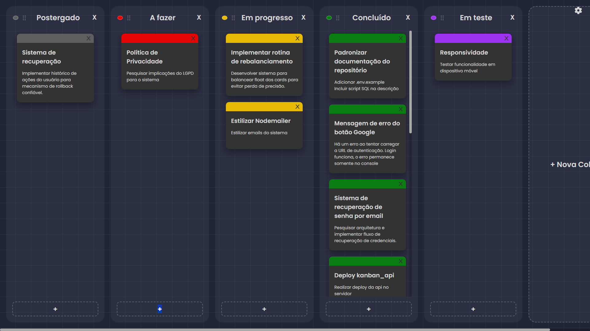
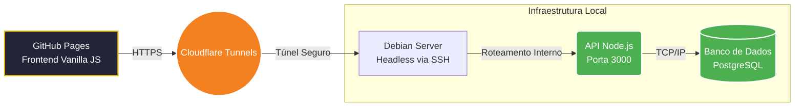
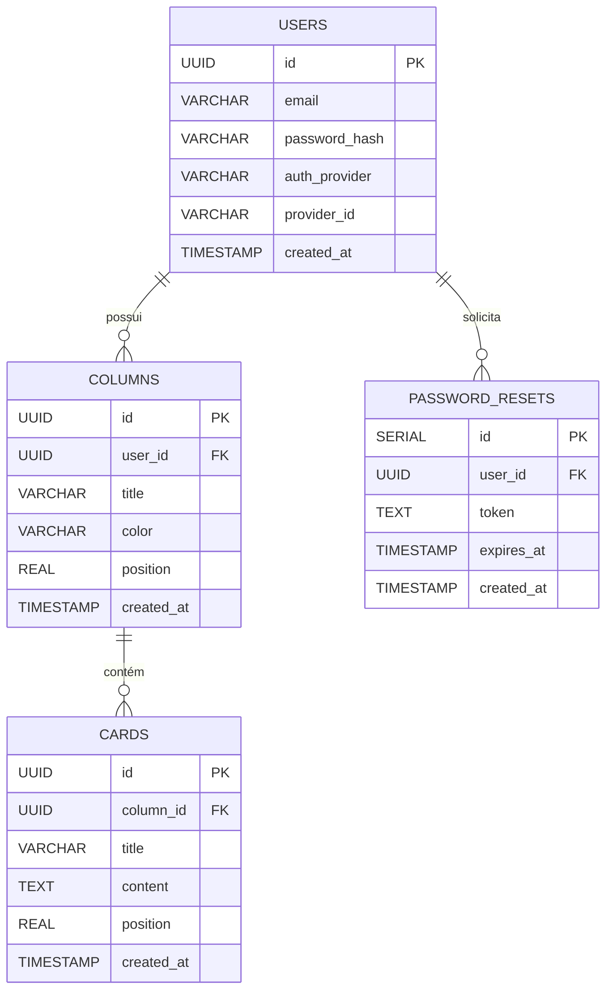

# Kanban Board API ⚙️

API REST responsável por centralizar as regras de negócio do **Kanban Board**, incluindo persistência em banco relacional e autenticação.  
O objetivo deste repositório é fornecer uma base clara e consistente para as operações do quadro (colunas, cards e usuários), priorizando integridade dos dados e facilidade de manutenção.

---

## 💡 Motivação

Este projeto surgiu da  vontade de apreender como implementar umaa lógica de Drag & Drop. Eu queria uma ferramenta simples para me organizar e se possível melhorar minah produtividade de algum forma. Acabei optando por um quadro Kanban com inspiração estética no Sticky Notes. Ironicamnente, acabei usando o próprio quadro Kanban para planejar e executar o desenvolvimento do quadro Kanban. A partir disso, fui imaginando mais funcionalidades interessantes para explorar e adicionar nele. Esse é o resultado.

---

## 🔗 Links do Projeto

- 🌐 **Aplicação em Produção:** https://kanban.matheusvandeursen.com
- 🎨 **Repositório do Frontend:** https://github.com/MatheusVanDeursen/kanban_web

---

## 🖼️ Prévia do Quadro (Screenshot)

---

## 📸 Arquitetura & Demonstração Visual

### Fluxo de Comunicação da Infraestrutura

A aplicação pode operar atrás de túneis reversos, permitindo auto-hospedagem da API sem exposição direta de portas no roteador. Isso ajuda em cenários com CGNAT e reduz a superfície de ataque ao evitar abertura de portas públicas desnecessárias.

### Diagrama de Entidade-Relacionamento (DER)

A persistência utiliza PostgreSQL com `uuid-ossp` para geração de chaves primárias UUID, reduzindo risco de enumeração previsível de IDs e facilitando integração distribuída.

---

## ✨ Decisões de Engenharia

### 📌 Ordenação com `REAL` para reordenação eficiente

Em quadros Kanban, mover itens pode gerar reindexações custosas quando a ordenação depende de índices inteiros (1, 2, 3…), exigindo múltiplos `UPDATE`s.

Neste projeto, colunas e cards utilizam um campo `position` (REAL) para minimizar reordenações:

- Ao mover para o topo: `position = próximo / 2`
- Ao mover para o final: `position = anterior + 1.0`
- Ao inserir entre dois itens (A e B): `position = (A + B) / 2`

Na prática, isso permite que um Drag & Drop seja refletido em **uma atualização principal**, reduzindo escrita em cascata e simplificando concorrência.

> Observação: em cenários de uso prolongado, pode ser útil ter uma rotina de “rebalanceamento” (renormalização) das posições para evitar perda de precisão.  

---

### 🔐 Autenticação (JWT) e Login Social (Google OAuth 2.0)

A API oferece:

- **Autenticação nativa** com `bcrypt` para hash de senhas e emissão de **JWT**.
- **Login com Google OAuth 2.0**, validando credenciais do cliente e emitindo um JWT do próprio sistema após verificação.

---

### 📧 Recuperação de conta (reset de senha)

O fluxo de redefinição de senha foi desenhado para evitar vazamento de informação e melhorar segurança:

1. Validação silenciosa de existência do e-mail (reduz enumeração).
2. Geração de token aleatório com `crypto`.
3. Envio de e-mail transacional com `Nodemailer` e registro com expiração na tabela `password_resets`.

---

### 🧱 Integridade no banco e validações

A modelagem foi criada com integridade referencial e deleções em cascata (`ON DELETE CASCADE`) quando apropriado, evitando registros órfãos.  
Nas rotas de atualização (`PATCH`), há validações para reduzir chances de dados inválidos chegarem ao banco.

---

## 🗄️ Inicialização do Banco de Dados

A modelagem e criação das tabelas estão versionadas no arquivo `scriptSQL.sql`, incluindo extensões e estrutura de relacionamento.

